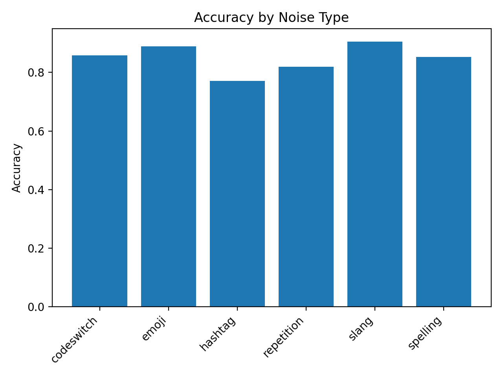
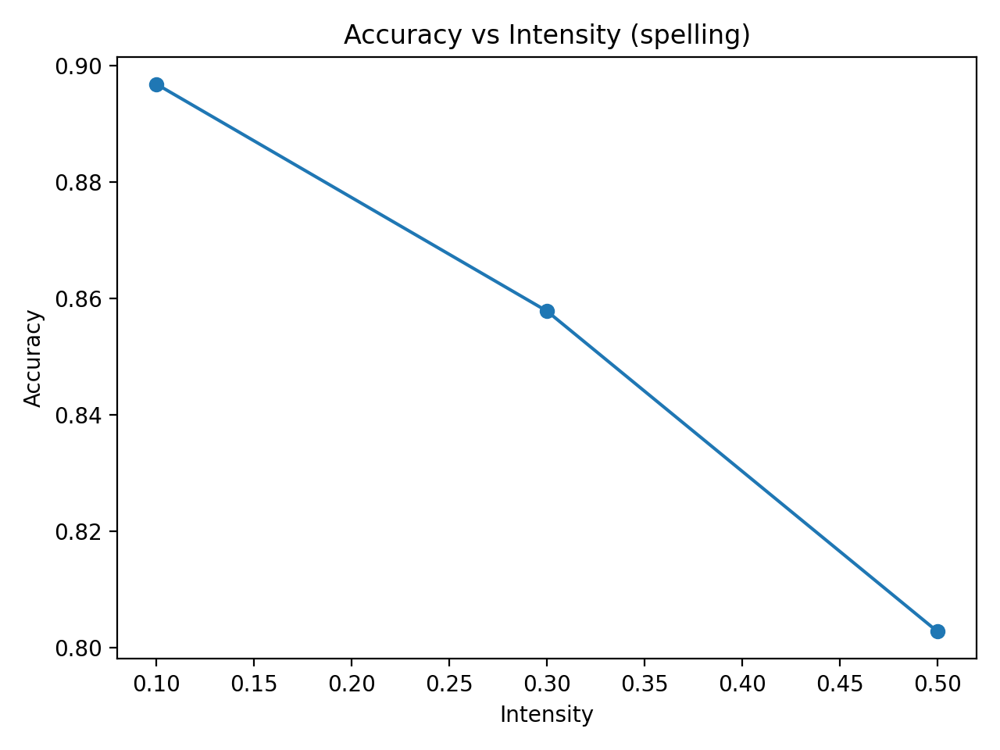

# Evaluating LLM Robustness Under Social Media Text Perturbations
**Zihao Huang (zh291), Jiacheng Gao**  
**ANLY-5800 – Fall 2025**

---

# Abstract
Large language models (LLMs) are increasingly deployed in noisy, informal text environments such as social media. However, most evaluation benchmarks contain clean, well-formatted text that does not reflect real-world usage. This project investigates the robustness of a pretrained sentiment classifier under emoji and spelling perturbations that simulate realistic social-media noise. Experiments on SST-2 show that emoji noise leads to mild degradation, while spelling errors cause severe accuracy drops. A simple normalization defense (lowercasing and repetition collapsing) fails to improve robustness. Results highlight an important robustness gap and motivate more advanced preprocessing or noise-aware training strategies.

## Introduction
Large language models (LLMs) have become widely used for sentiment analysis, content moderation, and social-media analytics. However, social-media text is highly informal—users frequently employ emojis, misspellings, elongated characters, slang, and multilingual code-switching. These noisy inputs differ significantly from the clean, standardized datasets that LLMs are typically trained and evaluated on.

As a result, LLMs may perform well under clean benchmark conditions yet fail on real-world text. Robustness to input noise is therefore an important property for deployed NLP systems, especially those operating on platforms like Twitter/X or TikTok.

This project investigates how a strong pretrained sentiment classifier behaves when exposed to simulated social-media perturbations. We focus on two noise types with distinct linguistic characteristics:

1. **Emoji noise** – insertion of random positive/negative emojis.  
2. **Spelling noise** – character-level corruption that mimics typos.

We further test whether a lightweight normalization pipeline (lowercasing and repetition collapsing) can recover performance. The goal is not to design a perfect defense, but to understand the model’s vulnerability patterns and the limits of simple preprocessing strategies.

## Methods

### Dataset
All experiments use the SST-2 sentiment classification dataset from the GLUE benchmark. Each sample contains a short movie review sentence labeled as **positive** or **negative**. We evaluate only on the validation split (872 samples), following standard practice.

### Model
We use a strong pretrained baseline:

- **distilbert-base-uncased-finetuned-sst-2-english**  
  (HuggingFace sentiment classifier)

Inference is performed through the `transformers` pipeline using PyTorch. No additional finetuning is done—this project focuses purely on robustness during evaluation.

### Perturbation Functions
We implement controlled social-media-style noise. This report focuses on two:

1. **Emoji noise**  
   Random insertion of emojis (e.g., 😀😭🔥👍) after a subset of tokens.

2. **Spelling noise**  
   Character-level corruption simulating typos by swapping adjacent characters inside words.

Both noises are parameterized by an **intensity** value (0.1, 0.3, 0.5), representing the probability of modifying each token.

### Normalization Pipeline
We test a lightweight preprocessing defense:

- **lower** → convert text to lowercase  
- **collapse** → reduce elongated sequences (e.g., “goooood” → “good”)

Normalization is applied *after* perturbation but *before* feeding text to the model.

### Evaluation Metrics
For each experiment we compute:

- **Accuracy**  
- **Macro F1**

We report metrics for:

- Clean baseline  
- Each noise type × intensity  
- Normalized vs. non-normalized comparisons

## Experiments & Results

### Baseline Performance on Clean SST-2
The clean evaluation establishes a strong reference point:

| Condition | Accuracy | F1 |
|----------|----------|----|
| **Clean** | **0.9106** | **0.9137** |

The DistilBERT sentiment classifier performs very well on standardized text.

---

### Effect of Emoji Noise
Emoji insertion introduces mild semantic and formatting disruptions.

| Intensity | Accuracy | F1 |
|----------|----------|----|
| 0.10 | 0.9071 | 0.9071 |
| 0.30 | 0.8853 | 0.8852 |
| 0.50 | 0.8761 | 0.8759 |

**Observation:**  
Emoji noise produces **gradual, predictable degradation**. Even at the highest intensity (0.5), performance remains relatively stable. Emojis add distractions but rarely break key sentiment cues.

### Figure 1: Average Accuracy by Noise Type

---

### Effect of Spelling Noise
Spelling corruption significantly harms accuracy.

| Intensity | Accuracy | F1 |
|----------|----------|----|
| 0.50 | **0.8028** | **0.8010** |

**Observation:**  
Character-level distortions threaten token integrity and often prevent the model from recognizing key sentiment words (e.g., *great → gerat*, *terrible → terribel*). This produces much sharper degradation compared to emoji noise.

### Figure 2: Accuracy vs Noise Intensity (Spelling)

---

### Normalization Defense Evaluation
We test whether a simple preprocessing defense can restore performance.  
The normalization pipeline consists of: lower → collapse

For spelling noise at 0.50 intensity:

| Condition | Accuracy | F1 |
|-----------|----------|----|
| Spelling 0.50 | 0.8028 | 0.8010 |
| **Normalized (lower + collapse)** | **0.8028** | **0.8010** |

**Observation:**  
Normalization does **not** improve performance. Spelling noise modifies internal character order, which our simple heuristics cannot repair. Lowercasing and repetition collapse fail to fix corrupted sentiment-bearing tokens.

---

### Summary of Findings
- Emoji noise → **mild degradation**, model is relatively robust.  
- Spelling noise → **large performance drop**, model is highly sensitive.  
- Normalization → **no measurable improvement** for spelling perturbations.  

These results indicate that character-level noise poses a more fundamental challenge to LLM-based classifiers than emoji-style surface-level distractions.

## Discussion
Our results demonstrate a clear distinction between surface-level noise and deeper linguistic corruption. Emoji insertions introduce additional tokens that rarely disrupt sentiment-bearing words, so the model retains relatively strong performance. In contrast, spelling noise alters the internal structure of key tokens, directly breaking the lexical patterns the model relies on. This highlights a known weakness of subword-based transformers: they rely on stable tokenization, and character-level errors can cause unexpected splits or out-of-vocabulary fragments.

The failure of simple normalization also suggests that robustness cannot be restored with lightweight heuristics. Because spelling noise changes the actual characters inside sentiment words, recovering the original form would require context-aware or model-based correction techniques, not simple lowercase/repetition handling.

These findings underline the broader challenge of deploying LLM systems in the wild, where input may be messy, noisy, multilingual, or adversarial.

---

## Conclusion
This project evaluates the robustness of a strong pretrained sentiment classifier under social-media-style perturbations. Emoji noise results in modest and predictable degradation, whereas spelling noise leads to significant performance drops. A simple normalization defense does not improve robustness, indicating that more sophisticated approaches—such as character-level models, noise-aware training, or contextual spell correction—are needed.

Overall, the study provides practical insights into LLM behavior under realistic input noise and highlights important gaps between benchmark performance and real-world reliability.

---

## Limitations & Future Work
- Only two noise types were studied; additional perturbations (slang, code-switching, hashtags) may reveal different vulnerability patterns.
- Only one model was evaluated; comparing multiple architectures would give a broader robustness profile.
- Normalization methods were simple; exploring neural spell correction or noisy finetuning may produce stronger defenses.

This work establishes a foundation for more comprehensive robustness evaluations of LLMs in noisy real-world environments.
